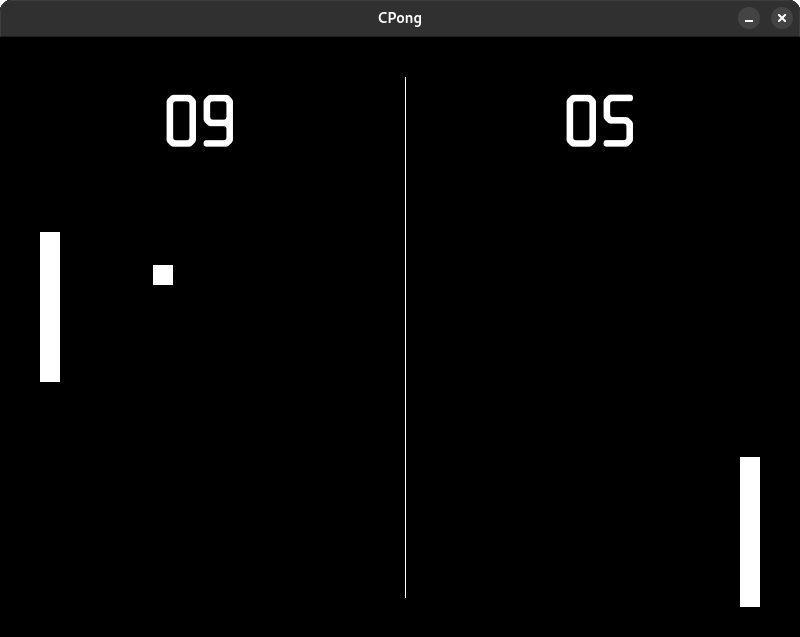

# CPong 

Pong clone written in C and using SDL3.

## Build

### cmake

Install `cmake` 3.30 or later from your Linux distribution or use `brew` on OSX.

### SDL3

Download and unpack [SDL3](https://github.com/libsdl-org/SDL/releases/download/release-3.2.16/SDL3-3.2.16.tar.gz) into `vendor/SDL3` directory  
Download and unpack [SDL3_ttf](https://github.com/libsdl-org/SDL_ttf/releases/download/release-3.2.2/SDL3_ttf-3.2.2.tar.gz) into `vendor/SDL3_ttf` directory  

### Compile

    $ cmake -DCMAKE_BUILD_TYPE=Release -B bin
    $ cmake --build bin

## Run

    $ ./bin/cpong

The WDXL Lubrifont TC font is licensed under the [SIL Open Font License, Version 1.1](data/OFL.txt).